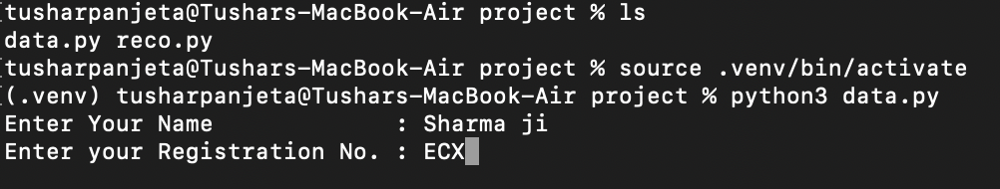
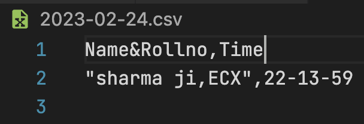

# <b><its>Students-Attendance</b></its>
<b>Tracking students attendance using face recognition<b>

Collection of data :  1.)Run data.py  2.)Enter deatils  3.)Cpture 5 images by pressing s

Verification :  1.)Run reco.py

Attendance will be taken and stored in file named by current date

